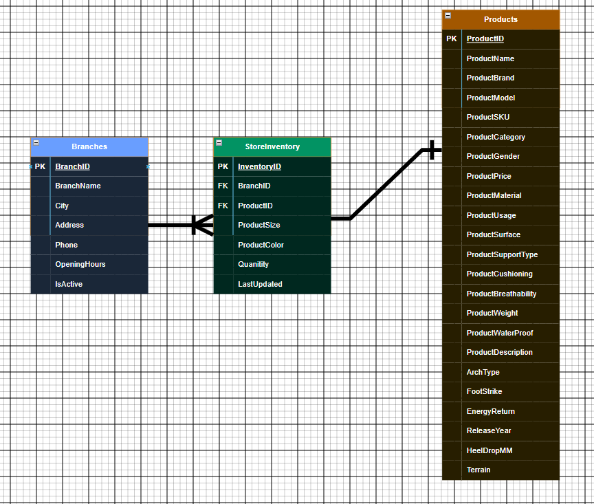

# NexFit Database ERD

## Entity Relationship Diagram

## Relationships

- **Branches (1) → StoreInventory (N)**: A branch can contain many inventory records.
- **Products (1) → StoreInventory (N)**: A product can be available in many inventory records across branches.
- **StoreInventory** acts as the junction entity between branches and products and stores inventory-specific attributes such as size, color, quantity, and last updated time.
